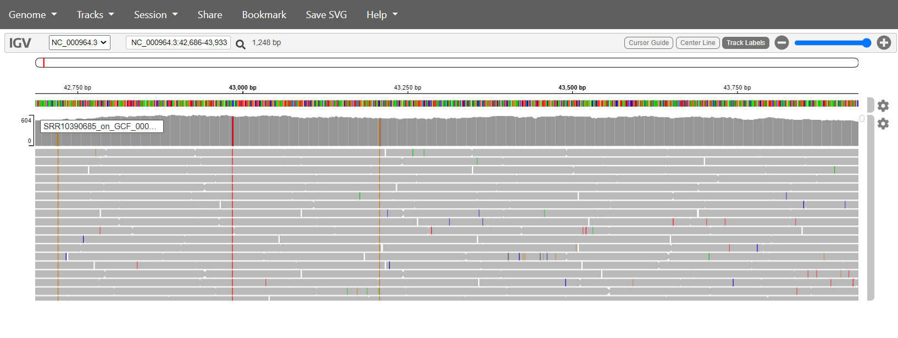

```{r setup, include=FALSE}
knitr::opts_chunk$set(eval=FALSE, echo =TRUE, cache = FALSE, message = FALSE, warning = FALSE, cache.lazy = FALSE,
                      fig.height = 3.5, fig.width = 10.5)
```

# Consignes {-}

Complétez ce document en remplissant les chunks vides pour écrire le code qui vous a permis de répondre à la question. Les réponses attendant un résultat chiffré ou une explication devront être insérés entre le balises html `code`. Par exemple pour répondre à la question suivante :

    La bioinfo c'est : <code>MERVEILLEUX</code>.
    
N'hésitez pas à commenter votre code, enrichier le rapport en y insérant des résultats ou des graphiques/images pour expliquer votre démarche. N'oubliez pas les **bonnes pratiques** pour une recherche **reproductible** !
Nous souhaitons à minima que l'analyse soit reproductible sur le cluster de l'IFB.

# Introduction {-}

Vous allez travailler sur des données de reséquençage d'un génome bactérien : _Bacillus subtilis_. Les données sont issues de cet article :

* [Complete Genome Sequences of 13 Bacillus subtilis Soil Isolates for Studying Secondary Metabolite Diversity](https://mra.asm.org/content/9/2/e01406-19)

# Analyses

## Organisation de votre espace de travail

```{bash} 
mkdir -p ~/EvaluationM4M5/FASTQ 
mkdir -p ~/EvaluationM4M5/CLEANING
mkdir -p ~/EvaluationM4M5/MAPPING
mkdir -p ~/EvaluationM4M5/QC
cd ~/EvaluationM4M5
tree ~/EvaluationM4M5
```

## Téléchargement des données brutes

Récupérez les fichiers FASTQ issus du run **SRR10390685** grâce à l'outil <strong class="tool">sra-tools</strong> @sratoolkit

```{bash}
module load  sra-tools


srun --cpus-per-task=6 fasterq-dump --split-files -p SRR10390685 --outdir FASTQ


```

Combien de reads sont présents dans les fichiers R1 et R2 ?

```{bash}
cd FASTQ

cat SRR10390685_1.fastq | echo $((`wc -l`/4))
cat SRR10390685_2.fastq | echo $((`wc -l`/4))

```

Les fichiers FASTQ contiennent <code> 7066055(R1) + 7066055(R2)  = 14132110 </code> reads.

Téléchargez le génome de référence de la souche ASM904v1 de _Bacillus subtilis_ disponible à [cette adresse](https://ftp.ncbi.nlm.nih.gov/genomes/all/GCF/000/009/045/GCF_000009045.1_ASM904v1/GCF_000009045.1_ASM904v1_genomic.fna.gz)

```{bash}
cd ../MAPPING/

wget https://ftp.ncbi.nlm.nih.gov/genomes/all/GCF/000/009/045/GCF_000009045.1_ASM904v1/GCF_000009045.1_ASM904v1_genomic.fna.gz

```

Quelle est la taille de ce génome ?

```{bash}

zcat GCF_000009045.1_ASM904v1_genomic.fna.gz | awk '/^>/{if (l!="") print l; print; l=0; next}{l+=length($0)}END{print l}' |paste - -

```

La taille de ce génome est de <code>  4215606 </code> paires de bases.

Téléchargez l'annotation de la souche ASM904v1 de _Bacillus subtilis_ disponible à [cette adresse](https://ftp.ncbi.nlm.nih.gov/genomes/all/GCF/000/009/045/GCF_000009045.1_ASM904v1/GCF_000009045.1_ASM904v1_genomic.gff.gz)

```{bash}
wget https://ftp.ncbi.nlm.nih.gov/genomes/all/GCF/000/009/045/GCF_000009045.1_ASM904v1/GCF_000009045.1_ASM904v1_genomic.gff.gz
```

Combien de gènes sont connus pour ce génome ?

```{bash}
zgrep -c $'\tgene\t' GCF_000009045.1_ASM904v1_genomic.gff.gz


```

<code> 4448 </code> gènes sont recensés dans le fichier d'annotation.

## Contrôle qualité

Lancez l'outil <strong class="tool">fastqc</strong> @fastqc dédié à l'analyse de la qualité des bases issues d'un séquençage haut-débit

```{bash}
cd ../
module load fastqc


gzip FASTQ/SRR10390685_1.fastq
gzip FASTQ/SRR10390685_2.fastq

srun --cpus-per-task 8 fastqc FASTQ/SRR10390685_1.fastq.gz -o QC/ -t 8
srun --cpus-per-task 8 fastqc FASTQ/SRR10390685_2.fastq.gz -o QC/ -t 8


```

La qualité des bases vous paraît-elle satisfaisante ? Pourquoi ?

- [ ] Oui
- [X] Non


car <code> R2 </code> comme le montre <code> a plus de base dans la zone rouge que R1 </code>

Lien vers le [rapport MulitQC](https://github.com/mkondratova/EvaluationM4M5/blob/main/Evaluation.html "rapport MulitQC")

Est-ce que les reads déposés ont subi une étape de nettoyage avant d'être déposés ? Pourquoi ?

- [X] Oui
- [ ] Non

car <code>  il était nécessaire d'enlever "adapter content" </code>

Quelle est la profondeur de séquençage (calculée par rapport à la taille du génome de référence) ?

```{bash}

```

La profondeur de séquençage est de : <code> 2.119142 G (total bases before filtering fastp) / 4215606 (ref genome size) = 502.7 (rather good) </code> X.

## Nettoyage des reads

Vous voulez maintenant nettoyer un peu vos lectures. Choisissez les paramètres de <strong class="tool">fastp</strong> @fastp qui vous semblent adéquats et justifiez-les.

```{bash}
module load fastp

srun --cpus-per-task 8 fastp --in1 FASTQ/SRR10390685_1.fastq.gz --in2 FASTQ/SRR10390685_2.fastq.gz --out1 CLEANING/SRR10390685_1.cleaned_filtered.fastq.gz --out2 CLEANING/SRR10390685_2.cleaned_filtered.fastq.gz --html CLEANING/fastp.html --thread 8 --cut_mean_quality 30 --cut_window_size 8 --length_required 100 --cut_tail --json CLEANING/fastp.json

```

Les paramètres suivants ont été choisis : 


|Parametre | Valeur | Explication |
|----------|--------|-------------|
|  |  |  |


Ces paramètres ont permis de conserver <code>13.554096M </code> reads pairés, soit une perte de <code> 95,90992427882319</code>% des reads bruts.

## Alignement des reads sur le génome de référence

Maintenant, vous allez aligner ces reads nettoyés sur le génome de référence à l'aide de <strong class="tool">bwa</strong> @bwa et <strong class="tool">samtools</strong> @samtools.

```{bash}
cd MAPPING/
GCF_000009045.1_ASM904v1_genomic.fna.gz > GCF_000009045.1_ASM904v1_genomic.fasta

module load bwa
srun bwa index GCF_000009045.1_ASM904v1_genomic.fasta


srun --cpus-per-task=32 bwa mem GCF_000009045.1_ASM904v1_genomic.fasta ../CLEANING/SRR10390685_1.cleaned_filtered.fastq.gz ../CLEANING/SRR10390685_2.cleaned_filtered.fastq.gz -t 32 > SRR10390685_on_GCF_000009045.1_ASM904v1.sam


module load samtools

srun --cpus-per-task=8 samtools view --threads 8 SRR10390685_on_GCF_000009045.1_ASM904v1.sam -b > SRR10390685_on_GCF_000009045.1_ASM904v1.bam

srun samtools sort SRR10390685_on_GCF_000009045.1_ASM904v1.bam -o SRR10390685_on_GCF_000009045.1_ASM904v1.sort.bam

srun samtools index SRR10390685_on_GCF_000009045.1_ASM904v1.sort.bam

srun samtools idxstats SRR10390685_on_GCF_000009045.1_ASM904v1.sort.bam > SRR10390685_on_GCF_000009045.1_ASM904v1.sort.bam.idxstats

srun samtools flagstat SRR10390685_on_GCF_000009045.1_ASM904v1.sort.bam > SRR10390685_on_GCF_000009045.1_ASM904v1.sort.bam.flagstat


samtools faidx GCF_000009045.1_ASM904v1_genomic.fasta

samtools faidx CP031214.1.fasta

```

Combien de reads ne sont pas mappés ?

```{bash}

```


<code>13.57 M -  12.83M  = 0.74 M </code> reads ne sont pas mappés. Data from MulitQC report

<code> 13571369 -  12826829 = 744540  </code> reads ne sont pas mappés. Data from flagstat and idxstats

## Croisement de données

Calculez le nombre de reads qui chevauchent avec au moins 50% de leur longueur le gène _trmNF_ grâce à l'outil <strong class="tool">bedtools</strong> @bedtools:

```{bash}


zgrep trmNF  MAPPING/GCF_000009045.1_ASM904v1_genomic.gff.gz  | awk '$3=="gene"' > trmNF.gff3


module load bedtools

bedtools bamtobed -i MAPPING/SRR10390685_on_GCF_000009045.1_ASM904v1.sort.bam  >  MAPPING/SRR10390685_on_GCF_000009045.1_ASM904v1.bed

bedtools intersect -a MAPPING/SRR10390685_on_GCF_000009045.1_ASM904v1.bed -b trmNF.bed  -f 0.5   > result_trmNF_bed.txt
grep -c 'NC_000964.3'  result_trmNF_bed.txt

```

<code> 2797 </code> reads chevauchent le gène d'intérêt.

MulitQC report 

```{bash}

export LC_ALL=en_US.UTF-8
export LANG=en_US.UTF-8

module load multiqc
srun multiqc -d . -o .

```


## Visualisation

Utilisez <strong class="tool">IGV</strong> @igv sous [sa version en ligne](https://igv.org/app/) pour visualiser les alignements sur le gène. Faites une capture d'écran du gène entier.



# References